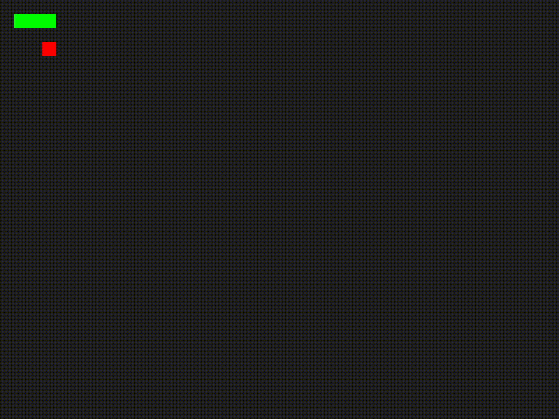

# Classic Snake

A implementation of Snake inside Rust

Based on Paulo Henrique Cuchi's writeup [here](https://blog.logrocket.com/using-sdl2-bindings-rust/#setting-up-rust-sdl2-project)

### Features
- Uses SDL2 bindings to handle rendering and user input
- Correct wall, food, and self collision detection
- Grows after consuming food
- Game Over state that can be restarted

### Controls
- **W** - Move Up
- **A** - Move Left
- **S** - Move Down
- **D** - Move Right
- **Esc** - Pause
- **Space** - Restart

### Building
To build 

`cargo build`

### NOTES
This uses rust's rand library instead of SDL2's. Will update (probably).

